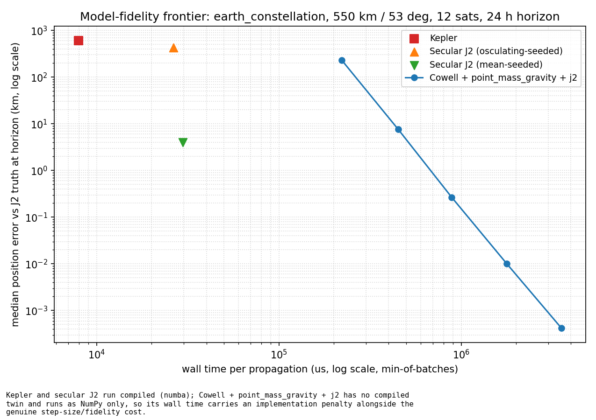
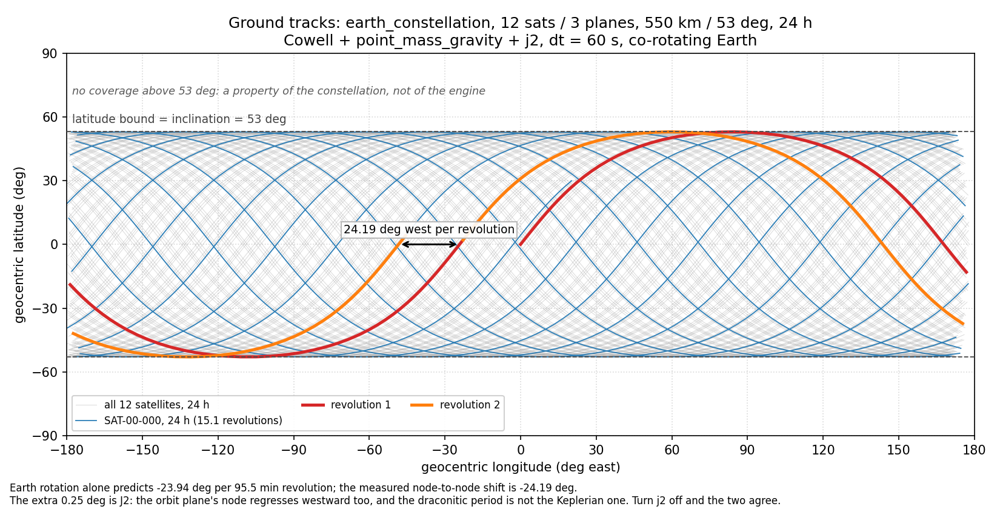
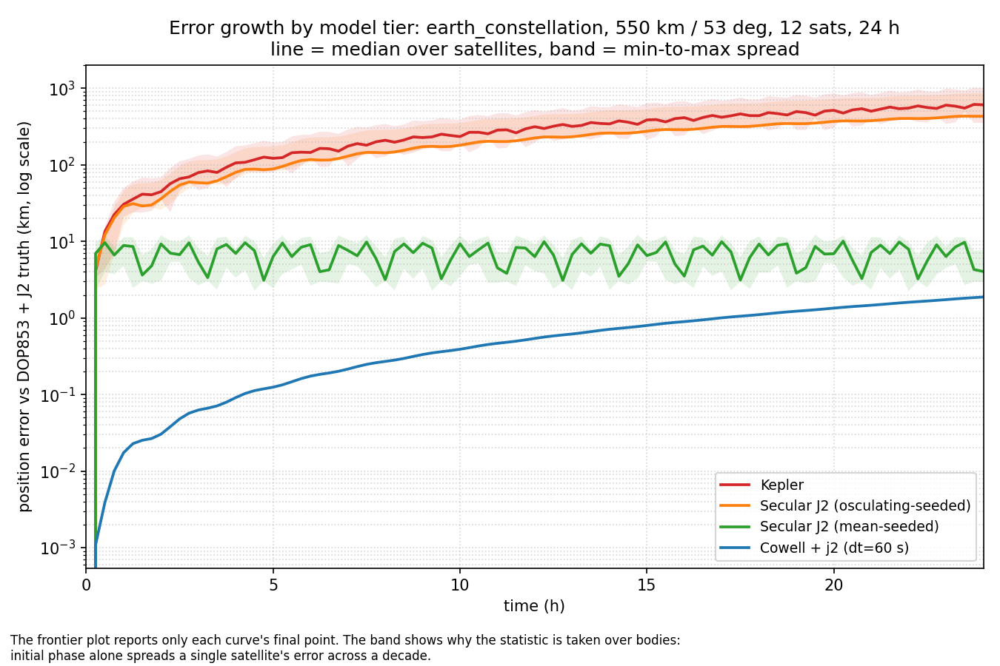
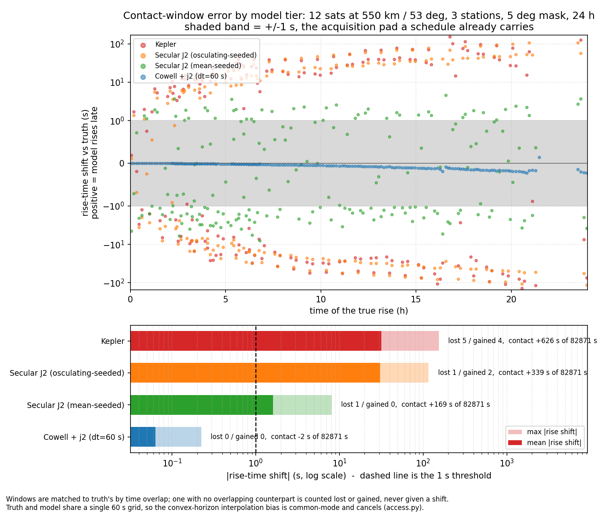
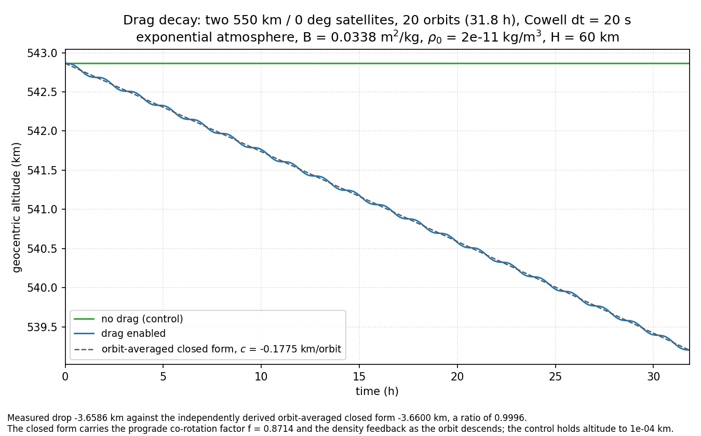
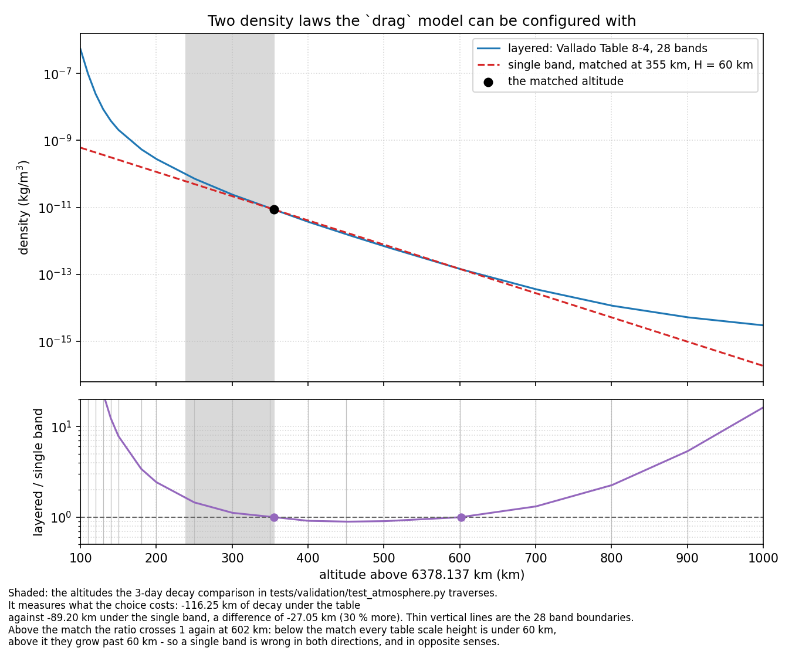
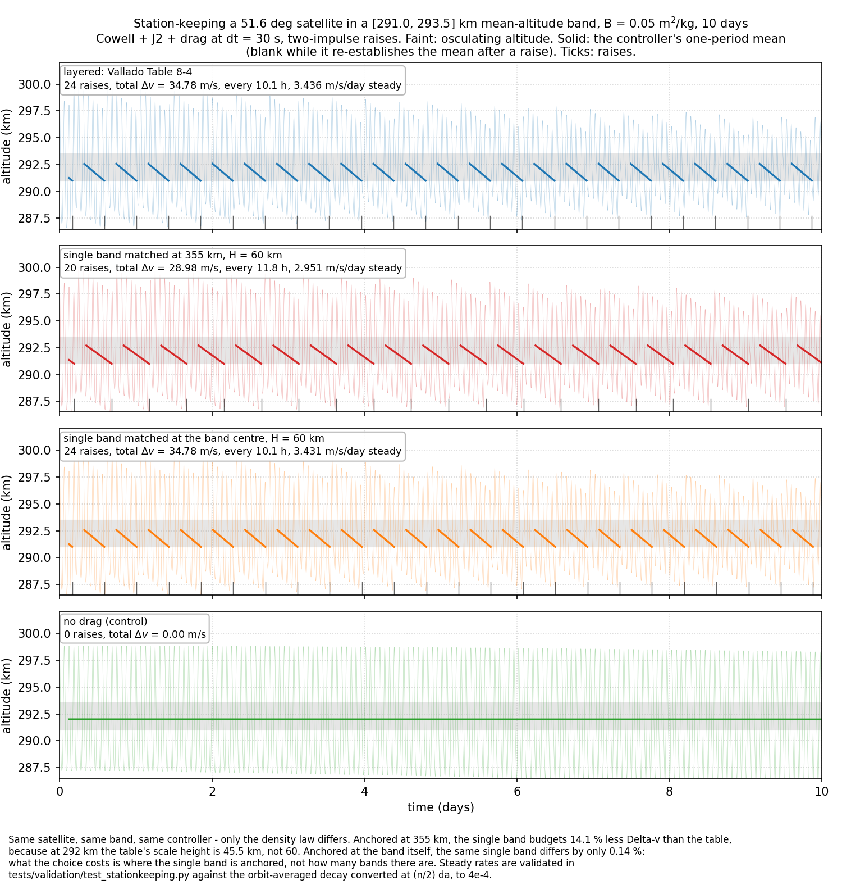
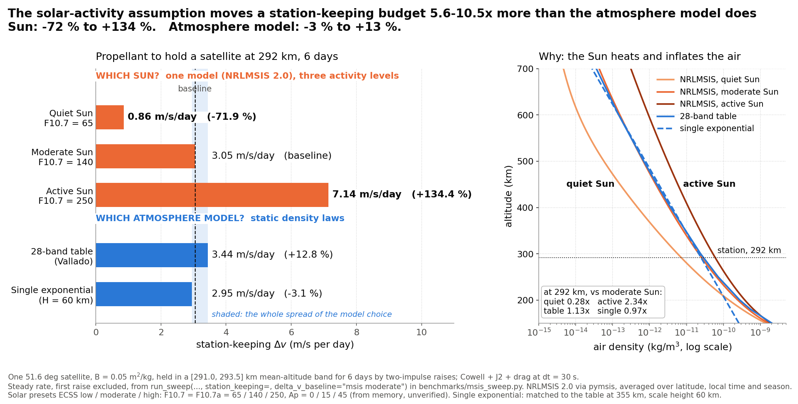
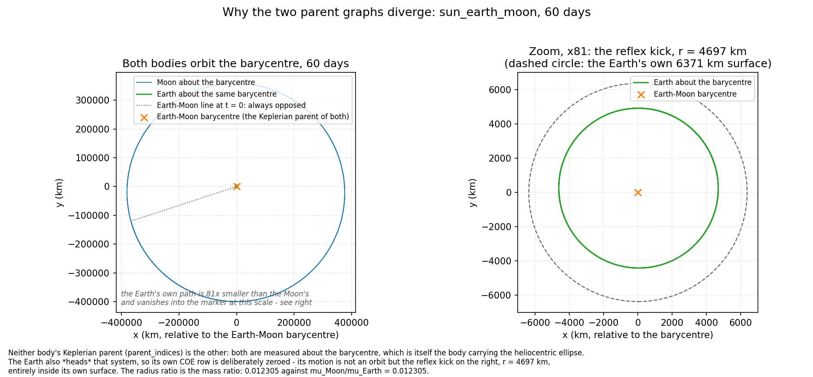

# OrbitalEngine
[](https://github.com/Antsstar/Orbit_Mechanics/actions/workflows/ci.yml)

A hierarchical orbital mechanics engine for measuring what a modelling assumption costs. One scenario
runs under many model configurations: analytic Kepler, secular J2, numerically integrated Cowell with
composable force models, and SGP4 through its reference implementation. Each configuration is scored
against an independent high-accuracy reference for wall time and for error. The error is reported in
kilometres and also in the units of the decision the model feeds:

- **seconds** of contact-window shift
- **passes** gained or lost
- **metres per second** of station-keeping Δv, where the solar-activity assumption turns out to move
  the budget [5 to 10 times more](#the-sun-against-the-atmosphere-model) than the choice of atmosphere
  model

Most astrodynamics libraries treat *running a simulation* as the primary operation. Here the main loop
is a **sweep**: model configurations are plain data, so the effect of an assumption on accuracy and
runtime is a measured output rather than a footnote.

Python 3.10+, NumPy and SQLAlchemy 2.0. Numba (compiled kernels), SciPy (reference trajectories),
`sgp4` (TLE ingest) and `pymsis` (NRLMSIS 2.0 density) are optional.

---

## The model-fidelity frontier

`orbital_engine.sweep` runs one scenario under several model configurations and scores each against a
common DOP853 + J2 reference, computed once and reused. `benchmarks/frontier_plot.py` runs it on a
12-satellite, 550 km / 53° constellation over 24 hours:



Median position error after 24 hours, and the wall time to reach that state:

- **Kepler: 608 km in 20 µs.** No J2 at all.
- **Kepler + secular J2, seeded from osculating elements: 431 km in 24 µs.** The secular drift removes
  the cross-track error. The along-track error remains, because mean motion is taken from the
  *osculating* semi-major axis, whose short-period J2 term acts as a fixed rate bias.
- **The same propagator seeded with a first-order *mean* semi-major axis: 4.0 km in 24 µs**
  (`propagators.mean_seeded_p`, after Kozai 1959 / Brouwer 1959). The remaining few km are the
  short-period oscillation an averaged theory cannot represent.
- **Cowell + `point_mass_gravity` + `j2`: 231 km at a 160 s step (3.1 ms) down to 0.0004 km at 10 s
  (51 ms).** Wall time rises 16× across that range, as fourth-order Runge-Kutta predicts: each
  halving of the step doubles the cost and cuts the error about 16-fold.

So the mean-seeded analytic tier sits on the frontier down to a few km. Doing better needs numerical
integration, at roughly 500–2,000× the cost: 0.27 km for 13 ms, 0.0004 km for 51 ms. Timings are
from an otherwise idle machine and agreed within 5% across two runs, except Cowell's coarsest point
(15%); errors do not vary.

Two caveats:

- **The analytic tiers reach the horizon in one step; Cowell has to step.** Kepler and secular J2 are
  closed-form in time, so their error does not depend on step size: 60 s steps and a single 24-hour
  step gave identical errors. The plot measures the cost of the horizon state, not of an ephemeris
  sampled at a fixed cadence, which would charge the analytic tiers per output point.
- **Single-satellite figures depend on starting phase.** Against the same truth, one secular-J2
  satellite's error after 10 orbits ranges from 0.2 km to 574 km depending on its initial argument of
  latitude (see `docs/architecture.md`). That is why the sweep reports statistics over all bodies.

Every tier runs compiled. Cowell uses `kernels.cowell_rk4_step`, a fused twin of RK4 +
`point_mass_gravity` + `j2` (and `zonal`, J3..J6, not enabled here), held to the NumPy path at 1e-12
relative. The re-base that places a Cowell or secular-J2 body on its parent's end-of-step position is
compiled too (`kernels.rebase_relative_states`, bit-identical to the NumPy block). Measured on the 12-satellite
scenario, one step costs about 6 µs for Cowell and 7 µs for secular J2 against 5 to 6 µs for Kepler;
with the NumPy re-base those were 17 and 24 µs.

---

## The gallery

`orbital_engine.viz` turns a simulation and a time grid into plottable arrays — ground tracks,
altitude series, error curves — with no plotting dependency of its own, exactly as `sweep.py` has
none. `benchmarks/figures.py` imports matplotlib and draws these:

### Ground tracks



Twelve satellites, three planes, 550 km / 53°, over 24 hours, Cowell + `point_mass_gravity` + `j2`
at a 60 s step, projected onto a co-rotating Earth. Each revolution's equator crossing is **24.19°
further west** than the last. Earth rotation alone accounts for 23.94° of that; the remaining 0.25°
is J2, which regresses the node westward and shortens the period. Turn `j2` off and the engine gives
−23.94089563° against a predicted −23.94089577° — an assertion in `tests/validation/test_viz.py`.

### Error growth by model tier



The time axis the frontier scatter collapses to a single point per tier. The final medians reproduce
the frontier's own numbers — 607.61 km, 431.31 km, 4.04 km — and the shape adds what the scatter
cannot show: **the mean-seeded curve is flat.** Its 4 km is a bounded short-period oscillation that
an averaged theory cannot represent, not an error that accumulates. Kepler and the osculating-seeded
tier grow without bound, and Cowell's curve is RK4 truncation.

### Contact windows: the same error in the units of a schedule



The same constellation and the same four tiers, scored instead on every pass over three ground stations
(Kiruna, Wallops, Santiago) at a 5° mask: 189 true passes in 24 hours. `run_sweep(..., access=spec)`
matches each predicted window to truth's by time overlap alone. A window with no overlapping counterpart
counts as a pass lost or gained and is never given a fictional shift.

| Tier | Mean \|rise shift\| | Max \|rise shift\| | Passes lost / gained |
|---|---|---|---|
| Kepler | 31.65 s | 154.21 s | 5 / 4 |
| Secular J2, osculating-seeded | 30.82 s | 115.82 s | 1 / 2 |
| Secular J2, mean-seeded | 1.60 s | 8.10 s | 1 / 0 |
| Cowell + J2, 60 s step | **0.063 s** | **0.223 s** | **0 / 0** |

Against a 1 s threshold, roughly the acquisition pad a real schedule already carries, Cowell + J2 is
the first tier that clears it, and the only one that neither invents nor loses a pass. The kilometre
metric misses two things this one shows:

- **Discrete failures.** Kepler does not just mistime its passes. It deletes five real ones and
  predicts four that never happen, and each of those is a scheduling decision, not an error bar.
- **Changed rankings.** Mean-seeded secular J2 is 150× better than Kepler in kilometres but only 20×
  better in window shift, and it still drops a marginal pass.

The Cowell figure checks itself. A 1.88 km along-track error moves a pass by `(1.88 / 6921) / (n − ω)`
= 0.265 s, and the measured 0.223 s is the along-track share of that error.

### Does a 550 km constellation need more than J2?

The same constellation, stations and mask, now against a truth that carries the EGM96 zonal harmonics
J2 through J6, with and without the engine's `zonal` model (J3..J6) enabled
(`benchmarks/zonal_sweep.py`):

| Tier | Median error, 24 h | Mean / max \|rise shift\| | Passes lost / gained |
|---|---|---|---|
| Cowell + J2, 15 s step | 1.265 km | 0.070 s / 0.588 s | 0 / 0 |
| Cowell + J2 + J3..J6, 15 s step | 0.0027 km | 0.0003 s / 0.0004 s | 0 / 0 |
| Cowell + J2, 60 s step | 3.109 km | 0.101 s / 0.730 s | 0 / 0 |
| Cowell + J2 + J3..J6, 60 s step | 1.877 km | 0.063 s / 0.223 s | 0 / 0 |

**Yes in kilometres, no in contact windows.** At a 15 s step, where RK4's own truncation is 2.7e-3 km,
omitting J3..J6 costs **1.26 km**, 470 times the step error. The same omission moves a rise time by
**0.07 s on average and 0.59 s at worst**, and no pass is gained or lost, so a schedule with a 1 s pad
does not notice it. The estimate written into the script before the first run was 1 to 2 km (J4's
secular drift of the argument of latitude, −1.3 km, plus a per-satellite offset from the J3/J4
short-period terms at the seed) and about 0.2 s of window shift. At a 60 s step the 1.88 km
truncation is the larger error. J4's term is secular, so a multi-day horizon would need it.

The zonal term is fused into the compiled Cowell step, so it is timed fairly: Cowell + J2 + J3..J6
costs **1.17×** the J2-only tier (0.048 s against 0.041 s over 24 h at 15 s). On the NumPy path it
was about 120×.

### ...and more than the zonal field? The tesserals do matter

The zonal terms are axisymmetric. The longitude-dependent field, the tesseral harmonics (here to
degree and order 4, EGM96, rotating with the Earth), is modelled by `tesseral` and carried by the
truth through an independent derivation. The same 24 h, 12-satellite, 3-station run, now against a
truth with J2..J6 **and** the 4×4 tesserals, both tiers Cowell + J2 + J3..J6 at 15 s
(`benchmarks/tesseral_sweep.py --leo`):

| Tier | Median / max error, 24 h | Mean / max \|rise shift\| | Passes lost / gained |
|---|---|---|---|
| Without `tesseral` | 3.819 km / 9.05 km | 0.288 s / **1.150 s** | 0 / 0 |
| With `tesseral` | 0.0027 km / 0.0027 km | 0.000 s / 0.000 s | 0 / 0 |

Omitting the tesserals costs **three times what omitting J3..J6 does**, and the worst rise shift
crosses the 1 s pad that J3..J6 stayed inside. The mechanism is each satellite's starting state: the
tesseral short-period terms shift the *mean* semi-major axis of an osculating seed by up to 0.068 km,
which predicts each satellite's along-track error with correlation 0.9992. The estimate written
before the run was about 1 km. The mechanism was right; the magnitude was three times low, because it
budgeted J22 alone when J31's term is the same size at LEO.

### Holding a geostationary slot

The zonal field cannot move a geostationary satellite in longitude; the tesseral field does, towards
two stable points, and every GEO slot's east-west station-keeping budget comes from it. With J22
alone the stable points are at exactly λ22 + 90° and λ22 + 270°, which is 75.07°E and 104.93°W. The
full 4×4 field moves them to **74.94°E and 105.09°W**, against the published 75.1°E and 105.3°W. That
is a comparison, not a verification: both the coefficients and the published figure carry
uncertainty, and degree 5 and above is not modelled.

Holding a slot costs `a |λ̈| / 3` per unit time, where λ̈ is the longitude acceleration. The engine
measures λ̈ by fitting the drift of a Cowell GEO satellite, and the costs agree with the closed form:

| Field | Worst slot, closed form | Worst slot, measured |
|---|---|---|
| J22 alone | 1.7635 m/s per year | 1.7637 m/s per year |
| 4×4 | 2.0659 m/s per year (117.36°E) | 2.0660 m/s per year |

Under J22 alone the four worst slots cost the same. Under the 4×4 field they do not (2.07, 1.87, 1.71
and 1.48 m/s per year), and most of that reshaping comes from J33.

### Drag decay



Two identical 550 km satellites over 20 orbits, one with `drag.py`'s exponential atmosphere enabled.
The measured drop is **3.6586 km against an orbit-averaged closed form of 3.6600 km**, a ratio of
0.9996. That closed form is derived independently in the figure script and carries two effects the
plot exists to make visible: the prograde co-rotation factor *f* = 0.8714, and the density feedback
as the orbit descends, which alone raises the mean rate 3.1% above the initial tangent. The control
holds altitude to 1 × 10⁻⁴ km.

### Two atmospheres, and what the choice costs in propellant



`drag` takes its density from either a single exponential band or a 28-band piecewise table (Vallado
4e Table 8-4). The choice is one coefficient per body, so it is a swept model axis like any other.

Match the single band to the table at 355 km with H = 60 km, the usual one-number-for-LEO setup. Below
that altitude the table is denser, because every one of its scale heights there is under 60 km. Above
it the ratio first dips below 1 and then climbs back through it near 600 km, so no single exponential
reproduces the table's shape at any H. Over three days from 355 km, the table predicts **27.1 km more
decay**, 30 % more.



`stationkeeping.py` converts that difference into propellant. The setup has four co-located 51.6°
satellites held in a [291, 293.5] km band for 10 days with two-impulse raises. The four panels are
identical except for the density law; the drag-free control never burns.

| Density law | Δv per day | Raises | Total |
|---|---|---|---|
| Table | 3.436 m/s | 24 | 34.78 m/s |
| Single band, matched at 355 km | 2.951 m/s (**14.1 % under-budgeted**) | 20 | 28.98 m/s |
| Single band, matched at the band centre | 3.431 m/s (0.14 % off) | 24 | 34.78 m/s |

**What costs propellant is where the simple model is anchored, not how many bands it has.**

The controller keys on the one-period *mean* altitude, not the osculating one. Under J2 the osculating
altitude swings 12 km peak to peak, the faint trace in the figure. A controller keyed to it would
fire once an orbit while inside the band.

The steady rates are validated against the orbit-averaged decay converted to Δv at `(n/2) Δa`, to
4 × 10⁻⁴.

### The Sun against the atmosphere model



Both static density laws above assume one fixed state of the Sun. NRLMSIS 2.0 (`pymsis`, wrapped in
`msis_bridge.py`) takes solar activity as input: the 10.7 cm radio flux F10.7 and the geomagnetic
index Ap. Here they are three per-body coefficients, so solar activity is one more sweep axis. The
same satellite and band as above, scored for 6 days by `run_sweep(..., station_keeping=spec,
delta_v_baseline="msis moderate")` (`benchmarks/msis_sweep.py`):

| Tier | Density at 292 km, vs baseline | Δv per day | vs baseline | Predicted before the run | Raises |
|---|---|---|---|---|---|
| NRLMSIS 2.0, moderate Sun (F10.7 = 140, Ap = 15) | 1 | 3.047 m/s | baseline | | 13 |
| NRLMSIS 2.0, quiet Sun (65, 0) | 0.280 | 0.855 m/s | **−71.9 %** | −71.96 % | 4 |
| NRLMSIS 2.0, active Sun (250, 45) | 2.341 | 7.142 m/s | **+134.4 %** | +134.43 % | 29 |
| 28-band table | 1.128 | 3.438 m/s | +12.8 % | +12.88 % | 14 |
| Single band, matched at 355 km | 0.969 | 2.952 m/s | −3.1 % | −3.11 % | 12 |

**The solar-activity assumption moves the Δv budget 5 to 10 times more than the atmosphere model
does**: a factor of 8.3 from quiet to active Sun (0.86 to 7.14 m/s per day), against 16 % across the
models (2.95 to 3.44). Each measured rate is within 6 × 10⁻⁴ of the prediction written in the script
before the first run, which models each law's density and local scale height, the orbit-averaged
decay and the Hohmann transfer phase.

The two static laws also *straddle* moderate MSIS. The previous section's "single band under-budgets
by 14 %" was measured against the table, and the table itself sits 13 % above moderate MSIS at 292 km.
Against MSIS, the single band is 3 % low.

`pymsis` is never called inside a step, and never downloads anything. Each solar-activity triple is
evaluated once at configuration time (1.3 s) into a mean profile over latitude, local time and day of
year, which the kernel then interpolates. What that average discards is listed under
[Known limitations](#known-limitations).

### The two parent graphs



`sun_earth_moon` over 60 days, drawn in the barycentric frame. Neither the Earth nor the Moon is the
other's Keplerian parent: both are measured about the Earth-Moon barycentre, which is the body
carrying the heliocentric ellipse. The Earth also *heads* that system, so its own element row is
deliberately zeroed — its motion is not an orbit but a 4697 km reflex kick, entirely inside its own
surface. The measured radius ratio equals μ_Moon/μ_Earth to **8 × 10⁻¹⁵**, which is the barycentric
model's defining invariant drawn rather than asserted.

---

## What is in the engine

**Architecture**

- **Data-oriented arena.** All state lives in flat, pre-allocated NumPy arrays indexed by integer
  slot. No object owns per-body state, and step cost is independent of arena capacity.
- **Two parent graphs, deliberately different.** `parent_indices` records what a body's orbital
  elements are measured against; `body_sys_map` records what its Cartesian state is measured against.
  The Moon's elements are relative to Earth while its position is relative to the Earth–Moon
  barycentre.
- **Reflex-kick barycentres.** A system's head body moves about the system's centre of mass. Siblings
  couple through that shared motion while every body's anomaly still advances analytically, so the
  analytic path steps backwards to rounding level (tested).
- **Two implementations of every hot path.** A readable NumPy reference defines the physics. A
  compiled Numba twin is held equivalent to it by tests.

**Models, selected per body as data**

- **Propagators** (`Simulation.set_propagator`):
  - **Keplerian.**
  - **Secular J2**: first-order drift of Ω, ω and M, with optional mean seeding.
  - **Cowell**: fourth-order Runge-Kutta, integrated relative to the body's parent so an accelerating
    parent is handled correctly.
- **Force models** (`Simulation.enable_force_model`), composed through a per-body bitmask:
  - **`point_mass_gravity`** and **`j2`**.
  - **`zonal`**: the J3..J6 zonal harmonics (EGM96), additive to `j2` and fused into the same compiled
    Cowell step.
  - **`tesseral`**: the longitude-dependent harmonics to degree and order 4 (EGM96), rotating with
    the Earth. It is the engine's first force that depends on time, so it is also the test that each
    Runge-Kutta stage sees its own time.
  - **`drag`**: a co-rotating atmosphere with a choice of density law: a single exponential band, a
    28-band piecewise table, or NRLMSIS 2.0. MSIS's solar activity (F10.7, Ap) is a per-body
    coefficient, so the state of the Sun is a sweep axis like any model choice.
  - **`third_body`**: one named point-mass perturber.
  - **`srp`**: cannonball solar radiation pressure, with a cylindrical or conical (umbra/penumbra)
    shadow.
  - **`thrust`**: a continuous burn in the RSW frame, with propellant depletion and a dry-mass floor.

  Models register configuration-time checks. For example, `j2`, `zonal` and `drag` refuse bodies whose
  parent is a barycentre, and `third_body` and `srp` refuse an invalid perturber or light source.
- **Impulses and events.** Impulsive Δv works under *every* propagator. On an analytic body a burn
  re-derives the elements, and secular J2 also rebuilds its cached drift rates. `step()` splits at a
  scheduled burn epoch, and at any sign change of a registered event function, located by
  Illinois false position. That second split is what restores RK4's order across the shadow terminator.
- **Sweep** (`orbital_engine.sweep`): `ModelConfig` lists run against one scenario, reporting median,
  RMS and maximum error over bodies, plus minimum-of-batches wall time.
  - With `access=`, it also scores **contact windows**: rise and set shifts, contact time, and passes
    lost or gained.
  - With `external=`, it scores a propagator that runs outside the engine, such as SGP4, against the
    same truth.
  - With `station_keeping=` and `delta_v_baseline=`, it runs a station-keeping controller under each
    configuration and scores the **Δv budget** against a named baseline configuration (truth has no
    drag, so the baseline is always stated, never inferred).
- **Observation geometry** (`geometry.py`, `access.py`): elevation, azimuth, range and range rate from
  a ground station; access windows; line of sight. The **contact dataset** of windows with rise, peak
  and set samples is the export a downstream network model consumes.
- **SGP4 bridge** (`sgp4_bridge.py`): wraps the `sgp4` package and never reimplements it. A TLE's mean
  elements never reach the engine's element conversion: vessels are seeded from SGP4's own Cartesian
  state.
- **NRLMSIS 2.0 bridge** (`msis_bridge.py`): wraps `pymsis` and never reimplements it. It runs once per
  solar-activity setting at configuration time, never inside a step, and never downloads space-weather
  data: the indices are configuration, not a date lookup.
- **Station-keeping** (`stationkeeping.py`): a dead-band altitude controller that turns the atmosphere
  choice into a Δv budget.
- **Independent truth** (`reference.py`): Newtonian N-body integration with DOP853, optionally with J2
  and J3..J6, sharing no code with the engine.

**Orbital toolbox**

- Cartesian ↔ classical elements, vectorised, with analytic fallbacks for circular, equatorial, polar
  and parabolic cases. Column 0 is the semi-latus rectum `p`, so parabolic orbits stay representable.
- The RSW (radial, along-track, cross-track) frame.
- True ↔ eccentric ↔ mean anomaly for elliptic, parabolic and hyperbolic orbits, plus Kepler's and
  Barker's equations.

---

## Scope: where this project stops

This engine is a **bench for comparing models**, not an application. The line it draws is not by
topic but by what a thing depends on:

- **Here:** anything that is a property of *bodies and orbits*. Propagation, force models, the
  reference truth, the sweep, and observation geometry — visibility, occultation, access windows,
  range and range rate. Shadow geometry lives here for the same reason: `srp` and the access metric
  share one line-of-sight test, because "is the satellite eclipsed" and "can the station see it" are
  the same question asked of different bodies.
- **Downstream:** anything that is a property of *hardware or of a graph*. Link budgets (transmit
  power, antenna patterns, noise temperature, modulation), Doppler shift as a carrier offset,
  contact-graph routing, handover policy, and constellation network emulation. None of it needs the
  arena once the contacts exist.

**The seam is the contact dataset**: access windows with range and range rate, per station and body.
A downstream project consumes that and never imports `Simulation`. Keeping the seam there is what
lets this repository stay a comparison instrument rather than growing into a network simulator with
an orbit propagator inside it.

This also sets what the engine owes a consumer: a stable exported dataset, a version, and an install
that works without the editable checkout.

---

## Verification

| | |
|---|---|
| Tests | 716 passing |
| Type checking | `mypy --strict`, clean across 35 source files |
| CI | Python 3.10 / 3.11 / 3.12 with compiled kernels, plus a job without Numba |
| Coverage | 92%, measured with Numba disabled at 696 tests (timing tests deselected) |
| Published reference | Vallado et al. (2006) SGP4 verification vectors, all in-tolerance cases |

> Measure coverage with Numba disabled. `coverage.py` traces bytecode, so a `@njit` function reads as
> entirely unhit, and the compiled run reports a well-covered kernel module as mostly untested.

The suite follows the verification and validation split used in computational science: *are the
equations solved right* versus *are they the right equations*.

```text
tests/
├── unit/         # Isolated transformations: analytic geometries and round-trip properties
├── integration/  # ORM polymorphism, simulation construction, history recording
└── validation/   # Physical correctness against closed forms, conserved quantities and
                  # independent numerical references, plus kernel equivalence
```

**Validation tests assert an expected error magnitude derived in advance, not just that nothing
crashed.** In orbital mechanics a sign error rarely raises. It produces a trajectory that integrates
cleanly, plots plausibly and is wrong by a few percent. Some of what the suite pins down:

- **Conserved quantities.** Specific energy, and angular momentum as a *vector*, since a propagator
  that preserved `|h|` while rotating the orbital plane would pass a magnitude check.
- **Convergence order.** Cowell's error must fall about 16-fold per halving of the step, both against
  Keplerian motion and against the J2 reference. It converges to 9.2e-8 km at 2048 steps per orbit.
  A missing physical term does not shrink with the step size, so this catches bugs a fixed tolerance
  would miss. An early Cowell version that ignored the parent's own acceleration, found in review,
  fails it.
- **Independent derivations.** The reference J2 field is derived in spherical coordinates, while the
  engine uses the Cartesian form. They agree to 1.2e-15. The reference J3..J6 field is typed out as
  explicit Cartesian monomials, while the engine uses Legendre recursions; they agree to 8.9e-14 of
  each degree's scale. Where the engine's model is exact, engine and reference agree to 7.5e-5 km
  over ten days.
- **Time-reversibility.** Stepping forward then backward returns the analytic arena to rounding level
  (3.4e-11 relative after 1000 steps each way). An `abs(dt)` bug planted in the compiled kernel
  passed every other test and was caught only here.
- **Barycentric mass moments.** `mu_Sun·r_Sun + mu_EMB·r_EMB = 0` is a definition, so it holds to
  floating-point noise, and any error in mass aggregation or the reflex kick shows as a drifting
  centre of mass.
- **Published reference vectors.** The SGP4 bridge is checked against Vallado et al. (2006)'s
  verification set, read from the installed `sgp4` package.
  - All 31 in-tolerance cases (1788 components) agree to the file's print rounding: mean |Δr| is
    2.5e-9 km, against a derived 2.5e-9.
  - All seven published error outcomes are reproduced.
  - Feeding the TLE's mean elements straight into the element conversion instead is **7.64 km** off at
    epoch. That anti-pattern is refused by design.
- **Order restored across a discontinuity.** Through a cylindrical shadow, Cowell's step-halving ratio
  collapses from 16 to 1.46. With event splitting at the terminator it returns to 16–18, and the error
  falls 177-fold.
- **Negative controls and mutation checks.** Equivalence and reference suites each include a test that
  deliberately breaks the engine and asserts the comparison notices. New physics is also checked by
  mutating the real source, such as a flipped sign or a wrong coefficient, and confirming the suite
  fails.

### Verification is not comparison

Where the engine's model is an approximation, it *must* disagree with the reference, and the
disagreement is the measurement. Hierarchical two-body motion neglects the solar term in the lunar
orbit, so over 30 days the Moon diverges by 3.3e4 km. That figure is asserted against a derived band:
solar tidal acceleration on the Moon is `2·μ_Sun·r_EM/d³ ≈ 3.05e-8 km/s²`, which acting coherently for
30 days would displace it by `½at² ≈ 1.0e5 km`. Partial coherence over a synodic month puts the true
value below that.

---

## Performance

Optimisation followed measurement, and the original plan turned out to be wrong. Step cost was
**flat** from arena capacity 64 to 10,000, and three bodies cost 542 µs against 602 bodies at 3583 µs.
That is roughly 490 µs of fixed per-step overhead against ~5 µs marginal per body. A cost that does not
move with problem size is not a data-layout problem, so the memory-layout work scheduled first would
have addressed about 4% of the step. Compilation addressed the rest.

Sun–Earth–Moon, microseconds per step:

| | µs/step | |
|---|---|---|
| Baseline | 556 | |
| Kepler solver rewrite | 474 | removed per-iteration dispatch |
| Compiled propagator | 28.8 | |
| Compiled global states | 8.3 | previous bottleneck at 87% |
| Columnar history | **3.0** | **185× total** |

Marginal cost fell from 1.26 to 0.196 µs per body; 2400 bodies step in 470 µs. Five bodies cost the
same in a 64-slot arena as in a 65,536-slot one. The original allocated-per-step scratch arrays
violated that by two orders of magnitude.

---

## How this project is developed

- **`docs/architecture.md`** records why the engine is shaped this way, including decisions that look
  accidental and are load-bearing.
- **`docs/engineering-log.md`** records problems hit and how they were resolved, including mistakes
  made during development and review.
- **`docs/flashcards/`** holds 96 spaced-repetition cards, exportable to Anki, on the architecture, the
  orbital mechanics and the reasoning behind each decision. A `--check` mode fails when a card cites
  a code symbol that no longer exists.
- **AI-assisted, review-gated.** Much of the implementation was written with Claude Code agents. Every
  change is re-verified independently before merge, with separate probes, mutation checks and derived
  error bounds, and the corrections that review produced are recorded in the engineering log.

---

## Directory layout

```text
Orbit_Mechanics/
├── .claude/agents/          # Agent definitions used during development
├── .github/workflows/       # Multi-version CI, plus a job without Numba
├── benchmarks/
│   ├── bench_step.py        # Step-cost instrument: propagator comparison, scaling, breakdown
│   ├── figures.py           # The gallery: tracks, error growth, drag, atmosphere, access,
│   │                        #   station-keeping, solar activity
│   ├── frontier_plot.py     # Runs the sweep and writes docs/figures/frontier.png
│   ├── msis_sweep.py        # Solar activity against the atmosphere model, in station-keeping Δv
│   ├── tesseral_sweep.py    # GEO slot longitudes in m/s per year; --leo for contact windows
│   └── zonal_sweep.py       # J2 against J2..J6 truth, in km and in contact windows
├── docs/
│   ├── architecture.md      # Why the engine is shaped this way
│   ├── engineering-log.md   # Problems hit and how they were resolved
│   ├── figures/             # frontier.png plus the gallery
│   ├── flashcards/          # Anki decks and exporter
│   └── historical/          # Superseded design documents, kept for provenance only
├── notebooks/               # Derivations and visualisation
├── src/orbital_engine/
│   ├── simulator.py         # Data-oriented arena and simulation control
│   ├── propagators.py       # NumPy reference propagators: Keplerian, secular J2, Cowell adapter
│   ├── kernels.py           # Compiled Numba twins (optional)
│   ├── integrators.py       # RK4, integrating relative to each body's parent
│   ├── forces.py            # Force-model composition and the kernel contract
│   ├── gravity.py           # point_mass_gravity
│   ├── geopotential.py      # j2
│   ├── zonal.py             # zonal: J3..J6, additive to j2
│   ├── tesseral.py          # tesseral: orders m >= 1 to degree 4, rotating with the Earth
│   ├── drag.py, atmosphere.py  # drag and its density laws
│   ├── msis_bridge.py       # NRLMSIS 2.0 via pymsis, evaluated at configuration time (optional)
│   ├── thirdbody.py         # third_body
│   ├── srp.py               # Solar radiation pressure, cylindrical and conical shadow
│   ├── thrust.py            # Continuous thrust with propellant depletion
│   ├── manoeuvres.py        # Impulsive Δv under every propagator
│   ├── events.py            # Event-driven step splitting
│   ├── registry.py          # Force-model and propagator registration
│   ├── sweep.py             # Model configurations as data; error and timing statistics
│   ├── geometry.py          # Elevation, azimuth, range rate, access windows, line of sight
│   ├── access.py            # Contact-window error metric and the contact dataset export
│   ├── sgp4_bridge.py       # SGP4 wrapped: TLE ingest and an external sweep tier (sgp4, optional)
│   ├── stationkeeping.py    # Dead-band altitude controller; atmosphere choice in Δv
│   ├── viz.py               # Plot-data preparation: ground tracks, altitude, error curves
│   ├── reference.py         # Independent DOP853 truth, optionally with J2..J6 (SciPy, optional)
│   ├── scenarios.py         # Scenario builders shared by tests and benchmarks
│   ├── frames.py            # Coordinate and state-space transformations, RSW
│   ├── utilities.py         # Anomalies, Kepler, Barker, rotations
│   ├── benchmark.py         # Minimum-of-batches timing
│   ├── database.py          # Polymorphic SQLAlchemy 2.0 ORM
│   ├── body.py, constants.py, custom_types.py, exceptions.py
│   └── data/planets.db
├── tests/
├── CLAUDE.md                # Engine ground truth: invariants, conventions, known-broken code
└── pyproject.toml
```

---

## Installation and running

```bash
conda create -n orbital_env python=3.11 -y
conda activate orbital_env
pip install -e ".[dev,test]"
```

`[test]` includes Numba, SciPy, `sgp4` and `pymsis` so the full suite runs, and `[dev]` adds matplotlib
for the figures. For a minimal install, each has its own extra:

- `[perf]`: Numba
- `[reference]`: SciPy
- `[sgp4]`: `sgp4`
- `[msis]`: `pymsis`

The engine itself runs on NumPy without any of them.

```bash
pytest                               # test suite
mypy src/ --strict                   # type checking
python benchmarks/frontier_plot.py   # regenerate the frontier figure (about a minute)
python benchmarks/figures.py         # regenerate the gallery (a few minutes)
python benchmarks/figures.py solar   # ...or only the figures named (ground, error, drag, hierarchy,
                                     #    atmosphere, access, stationkeeping, solar)
python benchmarks/zonal_sweep.py     # does a 550 km constellation need more than J2?
python benchmarks/tesseral_sweep.py  # GEO east-west cost by slot longitude (--leo adds the LEO sweep)
python benchmarks/msis_sweep.py      # solar activity against the atmosphere model, in Δv (a few minutes)
python benchmarks/bench_step.py      # step-cost benchmarks
```

> **Note.** Do not run `python -m orbital_engine.simulator`. Its `__main__` block rewrites the
> git-tracked database. Build an in-memory SQLite session as below, or as `tests/conftest.py` does.

---

## Usage

<details open>
<summary><b>Sweep three model configurations against the J2 truth</b></summary>

```python
from sqlalchemy import create_engine
from sqlalchemy.orm import sessionmaker
from sqlalchemy.pool import StaticPool

from orbital_engine import scenarios
from orbital_engine.custom_types import PropagatorType
from orbital_engine.database import Base
from orbital_engine.geopotential import EARTH_J2, EARTH_R_EQ
from orbital_engine.sweep import ForceModelSpec, ModelConfig, run_sweep


def build_scenario():
    engine = create_engine("sqlite:///:memory:", poolclass=StaticPool)
    Base.metadata.create_all(engine)
    return scenarios.earth_constellation(sessionmaker(bind=engine)(), n_sats=12, n_planes=1)


j2 = {"j2": EARTH_J2, "r_eq": EARTH_R_EQ}
day = 86400.0
configs = [
    ModelConfig("kepler", PropagatorType.KEPLERIAN, dt=day),
    ModelConfig("secular J2, mean-seeded", PropagatorType.SECULAR_J2, dt=day,
                propagator_coefficients=j2, mean_seed=True),
    ModelConfig("cowell + J2, 40 s", PropagatorType.COWELL, dt=40.0,
                force_models=(ForceModelSpec("point_mass_gravity"), ForceModelSpec("j2", j2))),
]

for r in run_sweep(build_scenario, configs, horizon_s=day, oblateness={"Earth": (EARTH_J2, EARTH_R_EQ)}):
    print(f"{r.config_name:24s} median error {r.error.median_km:9.3f} km   {r.wall_time_us:9.1f} us")
```

```text
kepler                   median error   607.611 km        21.7 us
secular J2, mean-seeded  median error     4.045 km        35.8 us
cowell + J2, 40 s        median error     0.266 km     35338.5 us
```
</details>

<details>
<summary><b>State vector to classical orbital elements and back</b></summary>

```python
import numpy as np
from orbital_engine.frames import ReferenceFrames

mu = 398600.4418
r = np.array([7000.0, 0.0, 0.0])
v = np.array([0.0, np.sqrt(mu / 7000.0), 0.0])

coe, success = ReferenceFrames.rv_to_coe(r, v, mu)
# coe -> [p, e, i, RAAN, arg_pe, theta]; success flags states with no valid orbit
r_out, v_out, valid = ReferenceFrames.coe_to_rv(coe, mu)
```

Both directions are vectorised: pass `(N, 3)` or `(N, 6)` arrays to convert many bodies at once.
Coordinate singularities resolve through analytic fallbacks rather than raising.
</details>

---

## Known limitations

- **Third-body forces are first order in the step size.** A Cowell body can carry one named point-mass
  perturber (`third_body`), but the perturber is held at its start-of-step position across the RK4
  stages. That lowers convergence from fourth to first order: 2.6 km on the Moon over 30 days at a
  1-hour step, against 2.5e4 km without the model. Full N-body forces are not modelled. Cowell bodies
  must be massless, and heads and barycentres cannot use Cowell.
- **J2 and the higher zonals assume a fixed spin axis.** The parent's spin axis is taken as the
  frame's z-axis. That is exact for the Earth-centred scenarios and 23.4° off in the ecliptic
  Sun–Earth–Moon scenario. The geopotential stops at degree 6 for the zonal terms and degree and
  order 4 for the tesseral ones. The tesseral model runs on the NumPy path, with no compiled twin yet,
  so its timings are not comparable with the fused tiers.
- **NRLMSIS 2.0 is averaged, by choice.** Each solar-activity setting becomes one global-mean density
  profile, averaged over latitude, local time and day of year, with the indices held constant. That
  discards the diurnal bulge (day/night **2.3×** at 400 km on the equator), the semi-annual season
  (**1.6×** in the global mean at 400 km) and any
  time variation of the indices, such as storms or the 27-day solar rotation. An orbit whose plane
  sweeps all local times sees the mean on average; a dawn-dusk sun-synchronous orbit never does.
- **Secular J2 is first order.** Mean seeding corrects only the semi-latus rectum `p` (and so the mean motion), never `e` or `i`.
- **TEME is treated as inertial.** SGP4's output frame drifts against a true inertial frame by about
  0.31 arcsec per day, roughly 11 m per day in LEO. That is negligible over the day-scale horizons
  here, but not for months-long runs or any comparison against GCRF data, which would need `pyerfa`.
- **Some citations and constants are unverified.** Several textbook equation numbers (Curtis,
  Vallado, Kozai/Brouwer), the 28-band atmosphere table, the EGM96 J3..J6 coefficients and the ECSS
  low/moderate/high solar-activity presets were written from memory. They are marked unverified in the
  source, beside the self-contained derivations that the tests check. The table's internal continuity
  check passes at every band boundary but one, at 25 km, which is asserted as a named anomaly. The same
  EGM96 table reproduces the engine's J2 within its printed digits, and the atmosphere table sits
  between 0.79 and 1.28 of moderate-activity MSIS from 150 to 1000 km: plausibility checks, not
  verification. The SGP4 vectors are the exception: they are read from the published file, not from
  memory.
- **One known edge case.** When *every* input state is degenerate, `rv_to_coe` returns an array of the
  wrong shape. See `CLAUDE.md`.

---

## Roadmap

Ordered so that each stage makes the next one safe rather than merely possible.

1. ~~**Validation infrastructure**~~: invariant harnesses, kernel equivalence and an independent DOP853
   reference. **Done.**
2. ~~**Compiled kernels**~~: 185× on the hierarchical step, with step cost independent of arena
   capacity. **Done.**
3. ~~**Force-model interface and events**~~: bitmask composition, per-body propagator selection,
   exact-time impulsive manoeuvres and event-driven step splitting. **Done.**
4. ~~**Benchmark harness**~~: the sweep, the frontier plot, and error in decision units (contact
   windows, station-keeping Δv). **Done.**
5. **Model library.**
   - **Done:**
     - J2 (force model, secular propagator and reference)
     - zonal harmonics J3..J6 (force model, compiled twin and reference)
     - tesseral harmonics to degree and order 4 (force model and reference)
     - Cowell RK4
     - third-body perturbations
     - drag with exponential and tabulated atmospheres
     - NRLMSIS 2.0 through `pymsis`, with solar activity as a sweep axis
     - solar radiation pressure with shadow geometry
     - continuous and impulsive thrust
     - the SGP4 bridge
   - **Planned:**
     - a compiled twin for the tesseral model
     - perturbers advanced per integrator stage
     - Encke
     - symplectic integrators
     - SGP4 on the frontier plot
6. **Constellation and inter-satellite link modelling.** This goes in a separate repository that
   consumes this engine's contact dataset (see [Scope](#scope-where-this-project-stops)). Walker
   generation and TLE ingest stay here.

Established external implementations are wrapped rather than reimplemented. SGP4, atmospheric density
models, planetary ephemerides and IAU frame and time transformations all have well-tested libraries,
and the interesting question here is how models *compare*, not whether they can be retyped.
