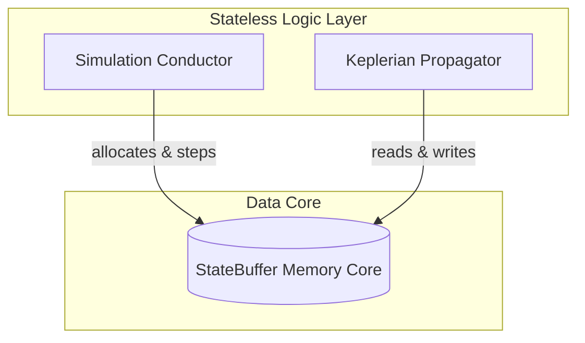

# Migration Blueprint: Hierarchical N-Body Orbital Engine (OOP to DOD)

This document is a comprehensive prompt designed for a Gemini Pro / Ultra extended-context model. It details the current Object-Oriented Design (OOD) codebase, the desired high-performance Data-Oriented Design (DOD) architecture, specific design constraints, resolved bugs, and step-by-step migration instructions.

---

## 1. System Prompt for Gemini Pro

```markdown
You are an expert systems architect and performance engineer specializing in physical simulation and Data-Oriented Design (DOD). 
Your task is to migrate a hierarchical N-body orbital mechanics simulation from its current Object-Oriented Design (OOD) to a cache-friendly, vectorized, high-performance Data-Oriented Design (DOD) using NumPy.

Ensure you adhere to the following principles:
1. Memory Contiguity: Consolidate state vectors, masses, and mappings into contiguous flat arrays managed by a central StateBuffer.
2. Stateless Conduction: Keep Simulation and Propagators stateless; they should modify the StateBuffer in-place or generate next-state buffers.
3. Precise Vectorization: Minimize Python loops inside hot loops. Use NumPy masks and indices for coordinate reductions and drift steps.
4. Mathematical Integrity: Keep parent-child relative coordinate conversions, Barker parabolic steps, and Kepler solvers accurate.
```

---

## 2. Current OOP Architecture Review

In the current OOP design, each body is an independent object holding its own kinematic vectors (`r`, `v`), orbital elements (`elements`), parent-child pointers, and lists:

*   **`BaseBody` (OOP)**: Holds properties like `name`, `radius`, `mu_self`, `mass`, `r`, `v`, `parent`, `children`, and a dict of `physics_models`.
*   **`Simulation` (OOP)**: Conductor storing a Python list of body references. Each `step` loops over every body and calls `KeplerianPropagator.propagate(body, dt)`, which calculates orbital elements and updates coordinates in-place.
*   **`KeplerianPropagator` (OOP)**: Operates directly on the `BaseBody` references.

---

## 3. Desired DOD Architecture Design

To achieve cache friendliness and clear separation of data from logic, the system is restructured into a contiguous **Data Core** and a **Stateless Logic Layer**:



### A. Memory Layout (`StateBuffer`)
All numerical states are pre-allocated in contiguous arrays within `StateBuffer`:
*   `local_curr`, `local_next` (Shape: `(max_bodies, 6)`): Local position and velocity relative to the parent frame origin `[x, y, z, vx, vy, vz]`.
*   `global_curr`, `global_next` (Shape: `(max_bodies, 6)`): Absolute position and velocity relative to the Barycentric Inertial Origin (system 0) `[x, y, z, vx, vy, vz]`.
*   `body_system_map` (Shape: `(max_bodies,)`): Mappings of body indices (`body_id`) to the coordinate system ID (`system_id`) they belong to.
*   `system_parent_map` (Shape: `(max_systems,)`): Mappings of coordinate system indices (`system_id`) to their parent system IDs.
*   `system_body_map` (Shape: `(max_systems,)`): Mappings of system IDs to the origin/center `body_id` defining that frame.
*   `body_masses` (Shape: `(max_bodies,)`), `system_masses` (Shape: `(max_systems,)`): Contiguous mass registries.

### B. Two-Pass Simulation Conductor Pipeline
1.  **Pass 1: Local Drift**: Propagate local Cartesian coordinates relative to system origins. Double-buffer local states (`local_curr` -> `local_next`).
2.  **Pass 2: Global Reduction (Vectorized Frame Tree traversal)**:
    Starting from System 0 (Universal Barycenter), broadcast coordinates down the frame tree:
    $$\vec{r}_{\text{global, child}} = \vec{r}_{\text{global, parent\_body}} + \vec{r}_{\text{local, child}}$$
    We traverse coordinate systems using a topological queue to resolve relative matrices down to absolute coordinates.

---

## 4. Key Implementation Rules & Solved Bugs

When implementing this DOD architecture, the following edge cases and bugs must be handled:

### 1. Sibling Propagation in Flat Hierarchies (The Frozen Earth Bug)
*   **Problem**: If the central body (e.g. Sun) and orbiting bodies (e.g. Earth) are both added directly to system `0` (Universal Barycenter), a naive check like `if system_id == 0: freeze_body()` will prevent the orbiting bodies (Earth) from moving.
*   **Solution**: Check `if parent_body_id == bid or parent_body_id == -1:` to freeze only the origin center body (Sun) or un-centered systems, but allow sibling bodies (Earth) in system `0` to propagate around the Sun's mass.
*   **Auto-Registry**: When a body is first added to system `0` (typically the Sun), the Simulation conductor must automatically register it as the origin of system `0` (`system_body_map[0] = sun_id`).

### 2. The Frame Mass Contradiction
*   **Problem**: In hierarchical coordination, the primary body (e.g., Earth) defining the origin of a sub-system resides physically in the parent system. Thus, its mass is not added to `system_masses[sub_system_id]`.
*   **Solution**: Do not look up `system_masses[sid]` for central Keplerian propagation. Instead, resolve the origin body ID from `system_body_map[sid]`, and read the central mass from `body_masses[parent_body_id]`.

---

## 5. File Blueprints for Migration

### A. [engine_content.py](file:///C:/Users/antss/CodingProjects/Personal/Orbit_Mechanics/src/orbital_engine/engine_content.py)
Declares a global pointer to make the active state buffer queryable by properties.
```python
from typing import Any, Optional

ACTIVE_BUFFER: Optional[Any] = None
```

### B. [topology.py](file:///C:/Users/antss/CodingProjects/Personal/Orbit_Mechanics/src/orbital_engine/topology.py)
Immutable handles to systems.
```python
from dataclasses import dataclass
from . import engine_content

@dataclass(frozen=True, kw_only=True)
class SystemNode:
    name: str
    system_id: int
    parent_id: int

    @property
    def total_mass(self) -> float:
        return engine_content.ACTIVE_BUFFER.system_masses[self.system_id]
```

### C. [state_buffer.py](file:///C:/Users/antss/CodingProjects/Personal/Orbit_Mechanics/src/orbital_engine/state_buffer.py)
```python
import numpy as np
from numpy.typing import NDArray

class StateBuffer:
    def __init__(self, max_bodies: int, max_systems: int):
        self.max_bodies = max_bodies
        self.max_systems = max_systems
        
        self.local_curr = np.zeros((max_bodies, 6), dtype=np.float64)
        self.local_next = np.zeros((max_bodies, 6), dtype=np.float64)
        self.global_curr = np.zeros((max_bodies, 6), dtype=np.float64)
        self.global_next = np.zeros((max_bodies, 6), dtype=np.float64)
        
        self.body_system_map = np.full(max_bodies, -1, dtype=np.int32)
        self.system_parent_map = np.full(max_systems, -1, dtype=np.int32)
        self.system_body_map = np.full(max_systems, -1, dtype=np.int32)
        
        self.body_masses = np.zeros(max_bodies, dtype=np.float64)
        self.system_masses = np.zeros(max_systems, dtype=np.float64)
        
        self.active_body_mask = np.zeros(max_bodies, dtype=np.bool_)
        self.active_system_mask = np.zeros(max_systems, dtype=np.bool_)
        
        self._body_ptr = 0
        self._system_ptr = 0

    def allocate_system(self, parent_id: int) -> int:
        sid = self._system_ptr
        self._system_ptr += 1
        self.active_system_mask[sid] = True
        self.system_parent_map[sid] = parent_id
        return sid  # Returns uid (generation index can be layered here if desired)

    def allocate_body(self, system_uid: int, mass: float, initial_local_state: NDArray[np.float64]) -> int:
        bid = self._body_ptr
        self._body_ptr += 1
        system_id = system_uid & 0xFFFFFFFF
        
        self.active_body_mask[bid] = True
        self.body_system_map[bid] = system_id
        self.local_curr[bid] = initial_local_state
        self.body_masses[bid] = mass
        
        # Accumulate mass up the tree
        curr_sid = system_id
        while curr_sid != -1:
            self.system_masses[curr_sid] += mass
            curr_sid = self.system_parent_map[curr_sid]
        return bid

    def set_system_origin(self, system_uid: int, body_uid: int) -> None:
        sid = system_uid & 0xFFFFFFFF
        bid = body_uid & 0xFFFFFFFF
        self.system_body_map[sid] = bid
```

### D. [simulator.py](file:///C:/Users/antss/CodingProjects/Personal/Orbit_Mechanics/src/orbital_engine/simulator.py)
```python
from __future__ import annotations
import dataclasses
from datetime import datetime, timedelta
from typing import Optional, Any, Dict
import numpy as np
import pandas as pd
from . import engine_content
from .body import BaseBody
from .state_buffer import StateBuffer
from .topology import SystemNode, TopologyFactory
from .types import Seconds

class Simulation:
    def __init__(self, max_bodies: int = 1000, max_systems: int = 100, start_epoch: Optional[datetime] = None) -> None:
        self.start_epoch = start_epoch if start_epoch else datetime.now()
        self.t = 0.0
        self.buffer = StateBuffer(max_bodies, max_systems)
        engine_content.ACTIVE_BUFFER = self.buffer

        self.bodies: Dict[int, BaseBody] = {}
        self.systems: Dict[int, SystemNode] = {}
        self.system_to_body: Dict[int, int] = {}
        self._history_buffer: list[dict[str, Any]] = []

        # Allocate System 0 (Universal Barycenter)
        self.buffer.allocate_system(parent_id=-1)
        self.systems[0] = SystemNode(name="Universal_Barycenter", system_id=0, parent_id=-1)

    def add_system(self, system: SystemNode, parent_uid: int, origin_body_id: Optional[int] = None) -> int:
        parent_id = parent_uid & 0xFFFFFFFF
        sid = self.buffer.allocate_system(parent_id)
        updated_system = dataclasses.replace(system, system_id=sid, parent_id=parent_id)
        self.systems[sid] = updated_system
        if origin_body_id is not None:
            self.system_to_body[sid] = origin_body_id
            self.buffer.set_system_origin(sid, origin_body_id)
        return sid

    def add_body(self, body: BaseBody, system_uid: int, initial_local_state: np.ndarray) -> int:
        mass = body.mass
        bid = self.buffer.allocate_body(system_uid, mass, initial_local_state)
        updated_body = dataclasses.replace(body, body_id=bid)
        self.bodies[bid] = updated_body

        # Auto-assign system 0 origin on first body add
        sid = system_uid & 0xFFFFFFFF
        if sid == 0 and self.buffer.system_body_map[0] == -1:
            self.system_to_body[0] = bid
            self.buffer.set_system_origin(0, bid)
        return bid

    def step(self, dt: Seconds, propagator: Optional[Any] = None) -> None:
        engine_content.ACTIVE_BUFFER = self.buffer
        if propagator is None:
            from .propagators import KeplerianPropagator
            propagator = KeplerianPropagator
            
        propagator.propagate(self.buffer, dt)
        self.buffer.local_curr[:] = self.buffer.local_next

        # Vectorized Coordinate Reduction
        queue = [0]
        while queue:
            curr_sid = queue.pop(0)
            mask = (self.buffer.body_system_map == curr_sid) & self.buffer.active_body_mask

            if curr_sid == 0:
                self.buffer.global_curr[mask] = self.buffer.local_curr[mask]
            else:
                parent_body_id = self.system_to_body.get(curr_sid)
                if parent_body_id is not None:
                    self.buffer.global_curr[mask] = self.buffer.global_curr[parent_body_id] + self.buffer.local_curr[mask]
                else:
                    self.buffer.global_curr[mask] = self.buffer.local_curr[mask]

            child_sids = np.where(self.buffer.system_parent_map == curr_sid)[0]
            for child_sid in child_sids:
                if self.buffer.active_system_mask[child_sid]:
                    queue.append(child_sid)

        self.buffer.global_next[:] = self.buffer.global_curr
        self.t += dt
        self._record_state()

    def run(self, duration: Seconds, dt: Seconds, propagator: Optional[Any] = None) -> None:
        if self.t == 0: self._record_state()
        steps = int(duration / dt)
        for _ in range(steps):
            self.step(dt, propagator=propagator)

    def _record_state(self) -> None:
        current_dt = self.start_epoch + timedelta(seconds=self.t)
        for bid, body in self.bodies.items():
            state = self.buffer.global_curr[bid]
            self._history_buffer.append({
                "timestamp": current_dt, "seconds": self.t, "body": body.name,
                "x": state[0], "y": state[1], "z": state[2],
                "vx": state[3], "vy": state[4], "vz": state[5]
            })

    @property
    def history(self) -> pd.DataFrame:
        return pd.DataFrame(self._history_buffer)
```

### E. [propagators.py](file:///C:/Users/antss/CodingProjects/Personal/Orbit_Mechanics/src/orbital_engine/propagators.py)
```python
import numpy as np
from .constants import G
from .frames import ReferenceFrames
from .utilities import Anomalies, Kepler, Barker

class KeplerianPropagator:
    @staticmethod
    def propagate(buffer: 'StateBuffer', dt: float) -> None:
        for bid in range(buffer.max_bodies):
            if not buffer.active_body_mask[bid]:
                continue

            sid = buffer.body_system_map[bid]
            parent_body_id = buffer.system_body_map[sid]
            
            # Allow sibling systems to propagate, but keep the origin body stationary
            if parent_body_id == bid or parent_body_id == -1:
                buffer.local_next[bid] = buffer.local_curr[bid]
                continue

            parent_mass = buffer.body_masses[parent_body_id]
            mu = G * parent_mass
            if mu <= 0.0:
                buffer.local_next[bid] = buffer.local_curr[bid]
                continue

            state = buffer.local_curr[bid]
            r, v = state[:3], state[3:]

            try:
                coe = ReferenceFrames.rv_to_coe(r, v, mu)
                if coe.theta is not None:
                    old_anom, anom_name = coe.theta, "theta"
                elif coe.u is not None:
                    old_anom, anom_name = coe.u, "u"
                else:
                    old_anom, anom_name = coe.lambda_true, "lambda_true"

                if abs(coe.e - 1.0) < 1e-12:
                    delta_M = Barker.t_to_M(mu, coe.p, dt)
                    new_M = Anomalies.true_to_mean_parabolic(old_anom) + delta_M
                    new_anom = Anomalies.mean_to_true_parabolic(new_M)
                elif coe.e < 1.0:
                    delta_M = Kepler.t_to_M(mu, coe.a, dt)
                    new_M = (Anomalies.true_to_mean(old_anom, coe.e) + delta_M) % (2 * np.pi)
                    new_anom = Anomalies.mean_to_true(new_M, coe.e)
                else:
                    delta_M = Kepler.t_to_M(mu, abs(coe.a), dt)
                    new_M = Anomalies.true_to_mean(old_anom, coe.e) + delta_M
                    new_anom = Anomalies.mean_to_true(new_M, coe.e)

                new_coe = coe._replace(**{anom_name: new_anom})
                r_new, v_new = ReferenceFrames.coe_to_rv(new_coe, mu)
                buffer.local_next[bid, :3] = r_new
                buffer.local_next[bid, 3:] = v_new
            except Exception:
                buffer.local_next[bid] = buffer.local_curr[bid]
```

---

## 6. How to Update Jupyter Visualizations

Once the backend is migrated to DOD:
1.  **Direct Global Coordinates**: The simulator's `df` contains `x, y, z` in the **absolute heliocentric frame** (global space). You do not need to add relative coordinates manually to plot global trajectories.
2.  **Relative Coordinates Calculation**: To compute the relative path of a secondary body (e.g. Moon) orbiting its parent (e.g. Earth), simply subtract the coordinate arrays:
    ```python
    moon_rel_x = df[df['body'] == 'Moon']['x'].values - df[df['body'] == 'Earth']['x'].values
    ```
3.  **Editable Reinstallation**: Before running the notebook, ensure you run `pip install -e .` from your activated environment terminal to link the notebook runtime to your local modified `src/` files.
